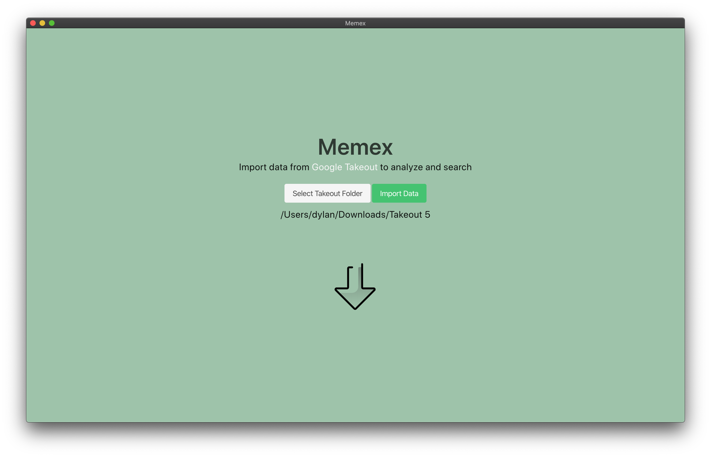
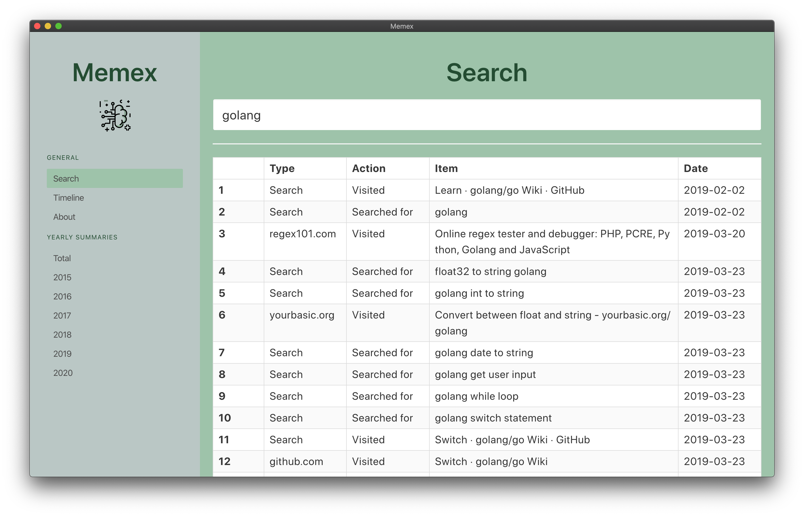
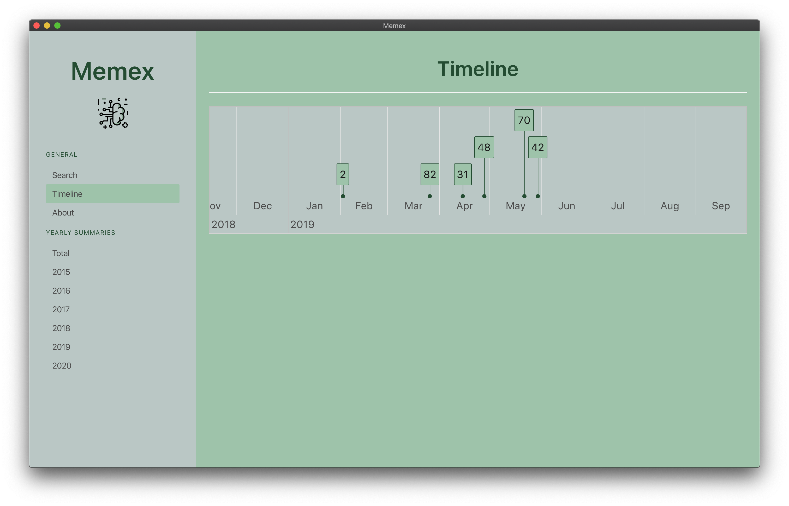
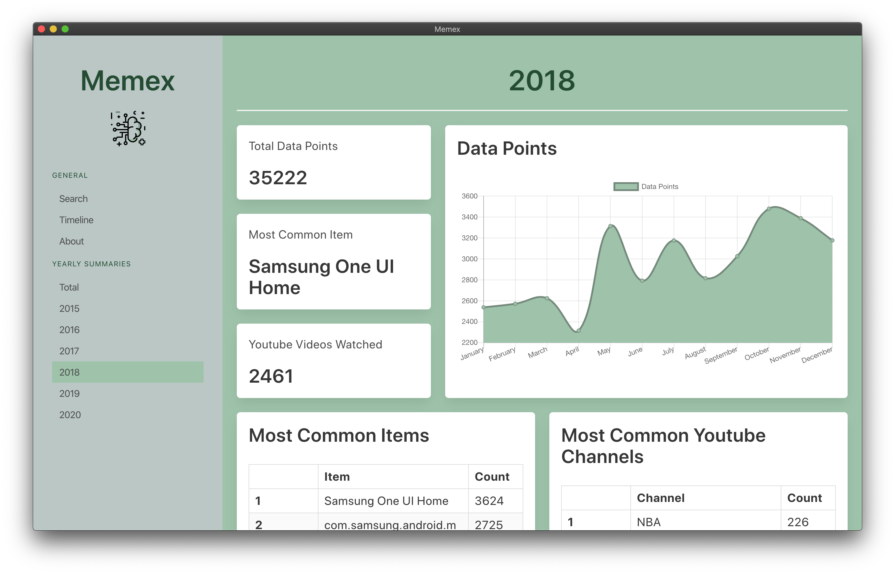
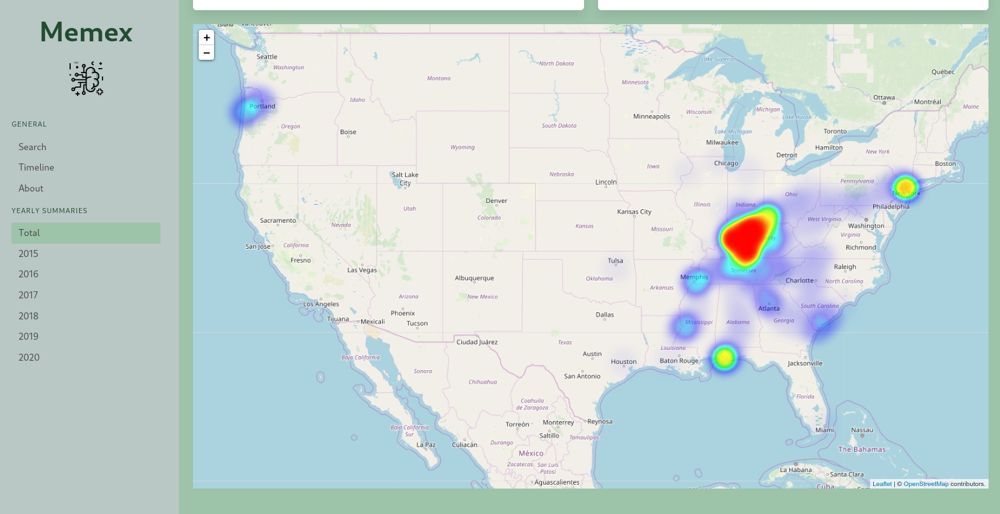

# Memex

A [memex](https://en.wikipedia.org/wiki/Memex) is a conceptual data storage and retrieval system outlined by Vannevar Bush. Although this project does not live up to this initial concept, it can still be used as a tool to search and analyze your digital data.

Currently, the project only uses data from parts of Google Takeout. I would like to extend it to provide more insights from Google Takeout, as well as insights on data
from other digital services.

Memex does not send your data to off-device locations. Everything is processed and handled on your device.

[Download Google Takeout data.](https://takeout.google.com/settings/takeout)

When downloading your data export as the largest download size (50 GB) as this keeps your data from being divided.

Icons created with [Gradientify](https://www.iconshock.com/svg-icons) by Iconshock

## Stack

This project uses ElectronJS and Bulma.io for the frontend, and Golang and SQLite3 as the backend. The Google Takeout data is parsed using [https://github.com/dylan-mitchell/ParseTakeout](https://github.com/dylan-mitchell/ParseTakeout).

## To Use

From source:

1. Clone the repo
2. `npm install`
3. `npm start` in project root

Check the Releases for builds. Currently I am unable to build for Mac as I do not own one :( .
There are `.deb`, `.snap`, `.pacman` for Linux and `.exe` for Windows.

## Screenshots

